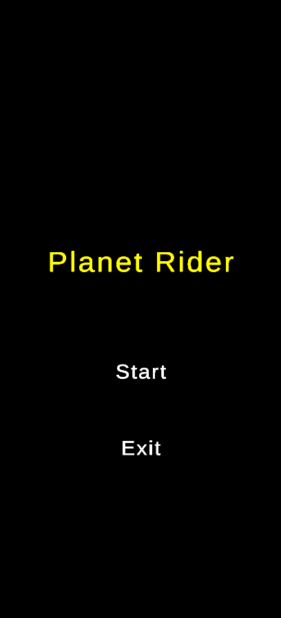
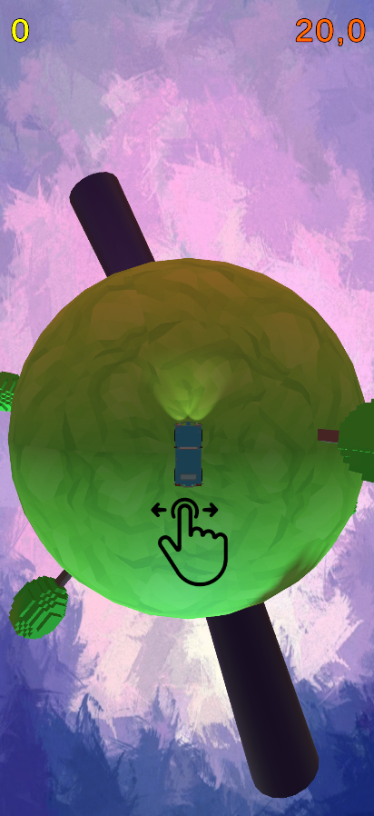
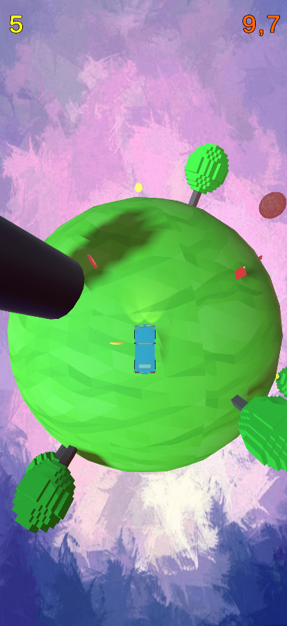
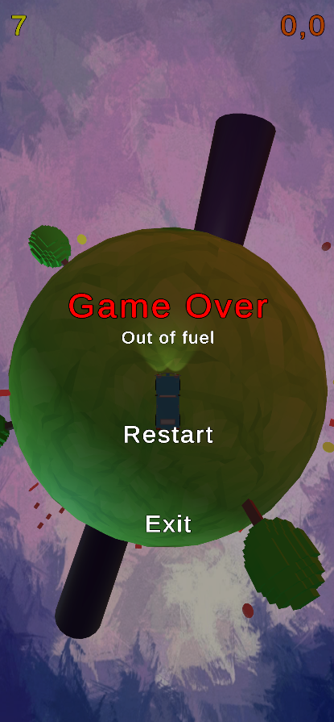

# PLANET RIDER  
Гиперкежуал гонка на выживание. 
Платформа: Android.  

[**Видео геймплея**](https://youtu.be/4pgQJndekcA)  
[**GitHub**](https://github.com/plotnik14/PlanetRider)  

### Gameplay Screenshots
   

# ЭРЕБОС  
**Проект находится на стадии доработки.**  
2D платформер про девочку из магической академии. Игра создана командой из 8 человек и является призером XYZ Game Jam. Как единственный программист в команде, я в рамках проекта реализовал следующее:  
•	Интеграция новых уникальных ассетов: спрайты, звук, видео.  
•	Сборка уровней.  
•	Реализация новых игровых механик по документации от геймдизайнера.  
•	Передвижение, ближняя и дальняя атака персонажа с использованием Input System.  
•	Логика поведения противников и боссов с помощью Coroutines и Animator.  
•	Верстка HUD и всех необходимых для игры UI элементов.  
•	Взаимодействие с камерой с помощью Cinemachine.  
•	Реализация кат-сцен.  
•	Освещение на основе Universal Rendering Pipeline.  
•	Сборка под PC.  

**Технологии:** C#, Unity, Git.  

[**Видео геймплея** (GameJam version)](https://youtu.be/fZmjbFi3S4M)  
[**GitHub**](https://github.com/plotnik14/xyz-cherry-jam)  

# PIRATE ADVENTURE  
2D платформер про пирата. Игра является выпускным проектом курса Unity от школы XYZ. В рамках проекта реализованы:  
•	Передвижение персонажа с использованием Input System.  
•	Анимации для всех объектов.  
•	Логика поведения противников и боссов с помощью Coroutines и Animator.  
•	Система инвентаря.  
•	Система прокачки характеристик и способностей героя.  
•	Верстка HUD и всех необходимых для игры UI элементов.  
•	Взаимодействие с камерой с помощью Cinemachine.  
•	Освещение на основе Universal Rendering Pipeline.  
•	Использование Particles System для дополнительных эффектов.  
•	Оптимизация с помощью Profiler и Sprite Atlas.  
•	Сборки под PC, Android и WebGL.  

**Технологии:** C#, Unity, Git.  

[**Видео геймплея**](https://youtu.be/l0xrb2JOxwo)  
[**GitHub**](https://github.com/plotnik14/platformer-xyz)  
